# 🏥 Hackios - Autonomous Medical Appeal Agent

> **An intelligent multi-agent system that fights insurance denials for you.**


---

## 🌟 Overview

**Hackios** is a cutting-edge Health Insurance Appeal Assistant powered by **Agentic AI**. It doesn't just generate text; it orchestrates a team of specialized AI agents to analyze, strategize, and fight incorrect claim denials.

By combining **PaddleOCR** for document understanding and **LangGraph** for multi-agent collaboration, Hackios turns a complex, stressful process into a single click.

---

## ✨ Key Features

### 🤖 Multi-Agent Collaboration
A team of 5 specialized agents works on every appeal:
1.  **Policy Agent**: Analyzes insurance policy documents for coverage rules.
2.  **Medical Agent**: Validates clinical necessity using ICD/CPT codes and guidelines.
3.  **Legal Agent**: Cites relevant state/federal laws (ERISA, ACA).
4.  **Negotiator Agent**: Synthesizes all arguments into a persuasive narrative.
5.  **Auditor Agent**: Critiques the draft and forces revisions if it's not perfect.

### 📄 Formal Appeal Generation
- **Professional Formatting**: Generates strictly formatted PDF appeal letters.
- **Dynamic Fields**: Automatically populates patient details, claim numbers, and dates.
- **Official Layout**: Includes sender/recipient blocks, subject lines, and signatures suitable for certified mail.

### 🔍 Intelligent Analysis
- **Pre-Claim Prevention**: Scores the "Denial Risk" (0-100%) before you submit.
- **Plain English Explanations**: Translates cryptic denial codes (e.g., CO-50) into understandable terms.

### 📱 Modern User Experience
- **Glassmorphic UI**: Beautiful, medical-grade dashboard interface.
- **Real-time Feedback**: Watch the agents work in real-time.
- **Secure Handling**: Local processing for OCR and database storage.

---

## 🏗️ System Architecture

Hackios uses a state-of-the-art **Cyclic Graph Architecture** powered by LangGraph.

```mermaid
graph TD
    User[User] -->|Uploads Docs| Frontend[React Dashboard]
    Frontend -->|POST| API[FastAPI Backend]
    
    subgraph "Backend Processing"
        API -->|Extract| OCR[PaddleOCR]
        OCR -->|Structured Data| Workflow[LangGraph Orchestrator]
        
        subgraph "Multi-Agent Workflow"
            Workflow --> Policy[🕵️ Policy Agent]
            Policy --> Medical[👨‍⚕️ Medical Agent]
            Medical --> Legal[⚖️ Legal Agent]
            Legal --> Neg[🤝 Negotiator Agent]
            Neg --> Audit[📝 Auditor Agent]
            
            Audit -- "Rejection (Fix Issues)" --> Neg
            Audit -- "Approval" --> PDF[PDF Generator]
        end
        
        PDF -->|Formal Letter| Database[(SQLite)]
    end
    
    Database -->|Download| User
```



---

## �️ Technology Stack

| Layer | Technology | Purpose |
|-------|------------|---------|
| **AI Orchestration** | **LangGraph** | Managing state and cyclic agent workflows |
| **LLM Inference** | **Groq** | Llama-3-70B (Reasoning) & Llama-3-8B (Extraction) |
| **Backend** | **FastAPI** | High-performance Python API |
| **Frontend** | **React + Vite** | Responsive, modern dashboard |
| **OCR** | **PaddleOCR** | Layout-preserving text extraction |
| **Database** | **SQLite + SQLAlchemy** | Local structured data persistence |
| **PDF Engine** | **ReportLab** | Programmatic PDF generation |

---

## 🚀 Quick Start

Get up and running in minutes.

### Prerequisites
- Python 3.10+
- Node.js 16+
- [Groq API Key](https://console.groq.com)

### 1. Setup Backend
```bash
cd backend
pip install -r requirements.txt
# Create .env file with your GROQ_API_KEY
python -m uvicorn main:app --reload --host 0.0.0.0 --port 8000
```

### 2. Setup Frontend
```bash
cd frontend
npm install
npm run dev
```

### 3. Access the App
Open your browser and navigate to: `http://localhost:5173`

---

## 🤝 Contributing

We welcome contributions! Please fork the repo and submit a PR.
This is a hackathon project built with speed and innovation in mind.

---

## � License

MIT License. Built for **Hackios 2026**.

> *"Healthcare is a right, not a privilege. Let AI fight the bureaucracy."*
